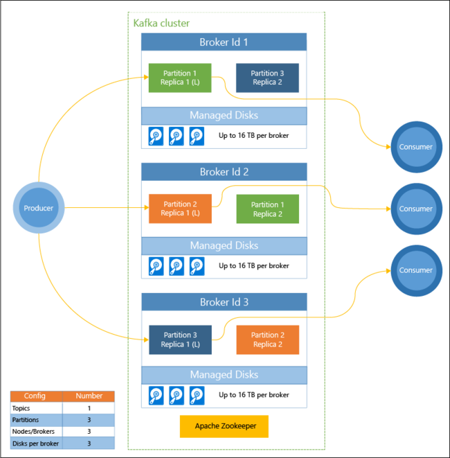

# Apache Kafka

## Kafka Theory Overview

### Basics 

1. Topics
    - a particular stream of data
    - similar to a table in a database
    - we can have as many topics as we want
    - a topic is identified by its name

* Partitions
    - topics are split in partitions
    - each partition is ordered
    - each message within a partition gets and incremental id,
     called offset
    - we need to choose the number of partitions when creating a topic

* Offsets
    - only have a meaning for a specific partition
    - order is guaranteed only within a partition
    - data is kept only for a limited time (default is one week)
    - once the data is written to a partition, it can't be changed
    (immutability)
    - data is assigned randomly to a partition unless a key is provided

    
### Broker

* A Kafka cluster is composed of multiple brokers (servers)

* Each broker is identified with its ID (integer)

* Each broker contains certain topic partitions

* After connecting to any broker (called a bootstrap broker), you 
will be connected to the entire cluster    

* When creating a topic, Kafka will automatically distribute all partitions
inside topic across all brokers (servers)

### Topic replication factor

* Topics should have a replication factor -> usually between 2 and 3

* Leader based replication -> at any time only ONE broker can ba a 
leader for a given partition, only that leader can receive and serve data,
the other brokers will synchronize the data

### Producers

### Consumers

* Consumers read data from a topic (identified by name)

* Consumers know which broker to read from

* Data is read in order within each partitions, there is no guaranty
across multiple partitions, kafka reads them in parallel (no specific 
order)

* Consumers read data in consumer groups

* Each consumer within a group reads from exclusive partitions

* If we have more consumers than partitions, some consumers will be
inactive

### Kafka Broker Discovery

* Every Kafka is also called a "bootstrap server"

* That means we only need to connect to one broker, and we will be
connected to the entire cluster

* Each broker knows about all brokers, topics and partitions (
not have the data but contains metadata about entire cluster)

### Zookeeper

* manages brokers (keeps a list of them)

* helps in performing leader election for partitions

* sends notifications to Kafka in case of changes

* by design operates with an odd number of servers (3,5,7)

* Kafka can't work without Zookeeper

* Zookeeper has a leader (handle writes) the rest of the serviers are 
followers (handle reads)

