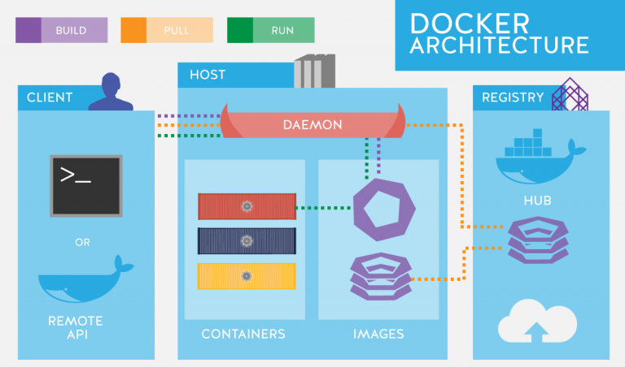

# Docker

Docker is a lightweight alternative to a virtual machine but it is not so isolated, 
it shares the operating system. This makes it boots up faster and consumes
less memory space (Mbs rather than Gbs)

Each container has its own libraries and dependencies, its own processes and so on.
Container is a running instance of an image.

### Docker vs WM


### Docker architecture 




### Docker installation

1. https://docs.docker.com/engine/install/ubuntu/

2. https://docs.docker.com/compose/install/
  
3. https://docs.docker.com/engine/install/linux-postinstall/

### Docker commands

* ```docker run <image>``` - run image, download if not present

* ```docker stop <container-id/name>```

* ```docker ps``` - list all running containers

* ```docker ps -a``` - list all containers

* ```docker rm <containerid/name>``` - remove container

* ```docker images``` - list all images

* ```docker rmi <image>``` - delete image and all dependent containers

* ```docker pull <image>``` - download image 

* ```docker exec -it <container name> <command>``` - execute any command inside 
docker container

* ```docker exec -it <container name> /bin/bash``` - get a bash shell in the container

Docker containers are designed to run services and applications. 
If we start the operating system without any commands, docker stops the container automatically.
* ```docker run -it ubuntu bash``` - run bash under ubuntu

* ```docker run -d centos sleep 20``` - run in background for 20 seconds


Attach and Detach - containers are run in attach mode by default, 
option -d can be used to run images in detach mode, example
* ```docker run -d ubuntu sleep 150``` - run in detach mode for 15 sec
* ```docker attach <containerId>``` - attach 

* ```docker inspect <containerId>``` - get all information about container, ex: IP address

Stdin - docker don't listen to standard input by default
* ```docker run -i some/app``` - docker listen to standard input

---
DOCKER LOGS

* ```docker logs <containerId>``` - list logs for container

* ```docker logs <containerId> -f``` - list logs with follow flag (tail)

* ```docker logs <containerId> --tail N``` - show the last number of log lines

* ```docker logs <container_id> | grep pattern```

* ```docker-compose logs``` - logs from all compose services

---

---
PORT & VOLUMES

* ```docker run -p 8080:8080 jenkins``` - port mapping 

* ```docker run -p 8080:8080 -p 50000:50000 -v /your/home:/var/jenkins_home jenkins```

--- 
DOCKER COMPOSE

In production we should use compose rather than manually starting every component

* ```docker-compose up``` - run all containers, require docker-compose.yml file 

* ```docker-compose -f path/to/compose/file.yml up``` - indicate the path to docker compose yaml file

* ```docker-compose stop``` - stop all containers, add -f <file path> if not in the same directory

* ```docker-compose down``` - remove all containers, add -f <file path> if not in the same directory

* ```docker-compose down -v``` - remove all containers and volumes, add -f <file path> if not in the same directory


### Build an docker image

1. Create Dockerfile
2. Put instructions inside it, every app image is based on OS image or other
app image so the first instruction is FROM os
3. Docker builds image in layered architecture, it means that each line of instruction 
creates a new layer in the docker image

    ```docker history <imageName>``` - shows information about every instruction that was
    executed during build

4. Build app:

    ```docker build Dockerfile -t skurski/app-name``` - example for docker build 
    
    ```docker build -f src/main/docker/Dockerfile -t app-name .```
    
    ```docker build . -t app-name``` - build inside folder with Dockerfile, 
    tag for app: app-name
    
5. Docker hub
    
    ```docker login``` - login to docker hub, required before pushing app to docker hub
    
    ```docker push repository-name/app-name``` - push image to your docker repository

### ORCHESTRATION - Docker Swarm or Kubernetes

On prod we should use tool for containers management that is placing containers on 
multiple machines instead just running docker from one machine. One machine is one single
point of failure.

https://phoenixnap.com/blog/kubernetes-vs-docker-swarm

### NETWORKING


Docker creates 3 networks automatically.
Bridge is a default network.

__Note__: When you use port mappings then you make the app accessibly from the host, it can
be access externally.


1. create a  network
* ```docker network create my-network```

2. start both containers, and attach them both to the `my-network` network
I named the mysql container `mydatabase`, just for demonstrating

* ```docker run -d --net=my-network --name=mydatabase mysql```

* ```docker run -d --net=my-network --name=myapp myappimage```

* ```docker network ls``` - list all networks

* ```docker network rm <network>``` - remove network

### Docker hub

https://hub.docker.com/search?q=&type=image


