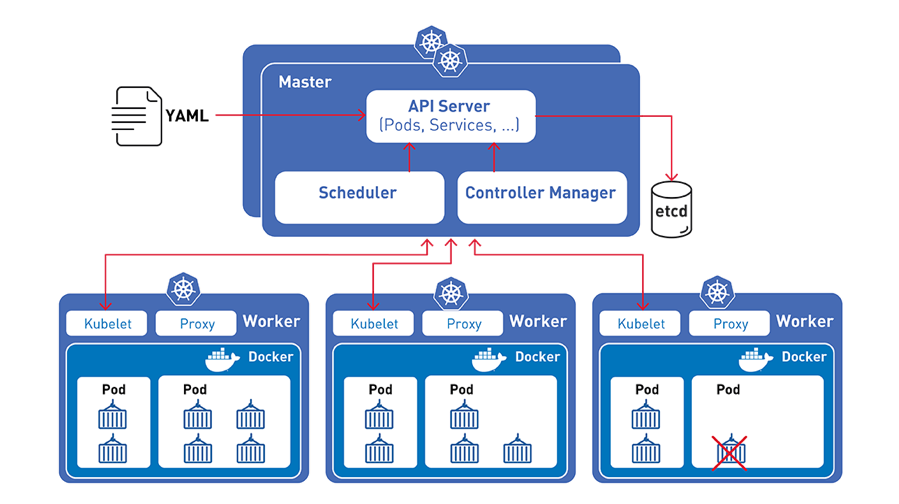

# Kubernetes

Tool for container orchestration.

Automatically deploying and managing containers is known as
container orchestration. Kubernetes is able to automatically scale out 
and in based on the load. 

Multiple instances of application running on different nodes. The user
traffic is load balanced across the various containers. When demand 
increases we can deploy more instances of the application using simple
declarative approach. 

### Architecture

### POD

Kubernetes does not deploy containers directly on the worker nodes.
Containers are encapsulated into a kubernetes object known as POD.
A POD is a single instance of a application.
Single POD can have multiple containers inside but there are usually not
multiple containers of the same kind -> to scale out application
we create new POD within existing node or new node with new POD inside.

Containers inside the same POD shares network and can connect to each
other directly (localhost).

### Kubectl

The Kubernetes command-line tool, kubectl, allows you to run commands 
against Kubernetes clusters. You can use kubectl to deploy applications, 
inspect and manage cluster resources, and view logs.

https://kubernetes.io/docs/tasks/tools/install-kubectl/

### Demo

https://labs.play-with-k8s.com/

https://kubernetes.io/docs/tutorials/kubernetes-basics/create-cluster/cluster-interactive/