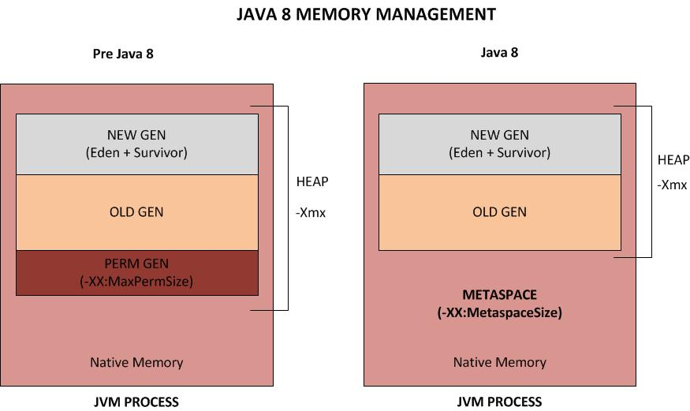

# JVM Memory Management - Garbage Collector

## General look:
  - __Young Generation__
    - __Eden__ - all new objects are located hear
    - __Survivor spaces__ - S0/S1 or "From" "To" (objects that survive are promoted to survivor spaces and then to old generation)
  - __Old Generation__
  - __Permament Generation__ - non-heap, for class metadata and methods
    - we need to set the size of PermGen, if it is smaller than the size of our application class metadata then we will get "Out of memory error"
    - PermGen is thied to Old Generation, if either of them is full, both are collected
    - in JDK8 in place of PermGen we have MetaSpace, metaspace uses native memory, no longer problem with not enough memory, we need to set
    the max size that metaspace can use, metaspace is not managed by garbage collector any more, it has it's own MetaSpace VM
    
## Java 7 vs Java 8

  - The key difference between PermGen and Metaspace is this: while __PermGen is part of Java Heap 
    (Maximum size configured by -Xmx option), Metaspace is NOT part of Heap__. 
    Rather Metaspace is part of Native Memory (process memory) which is only limited by the Host Operating System.

  - While you will NOT run out of PermGen space anymore (since there is NO PermGen), 
    you may consume excessive Native memory making the total process size large. 
    The issue is, if your application loads lots of classes (and/or interned strings),
    you may actually bring down the Entire Server (not just your application). 
    Why ? Because the native memory is only limited by the Operating System. 
    This means you can literally take up all the memory on the Server. Not good.
    __It is critical that you add the new option -XX:MaxMetaspaceSize  which sets the Maximum Metaspace size for your application.__
    
## How it works:
  - Different algorithms for young generation and old generation
  - GC types:
    - __Serial GC__
    - __Parallel GC__
    - __Parallel Old GC__
    - __CMS (Concurrent Mark Sweep) GC__
    - __G1 GC__ (long term replacement for CMS)
    
## The G1 garbage collector
The Garbage-First (G1) collector is a server-style garbage collector, 
targeted for multi-processor machines with large memories. 
It meets garbage collection (GC) pause time goals with a high probability,
 while achieving high throughput. The G1 garbage collector is fully 
 supported in Oracle JDK 7 update 4 and later releases. 
 The G1 collector is designed for applications that:

* Can operate concurrently with applications threads like the CMS collector.
* Compact free space without lengthy GC induced pause times.
* Need more predictable GC pause durations.
* Do not want to sacrifice a lot of throughput performance.
* Do not require a much larger Java heap.

G1 is planned as the long term replacement for the Concurrent Mark-Sweep
 Collector (CMS). Comparing G1 with CMS, there are differences that make 
 G1 a better solution. One difference is that G1 is a compacting collector.
  G1 compacts sufficiently to completely avoid the use of fine-grained 
  free lists for allocation, and instead relies on regions. 
  This considerably simplifies parts of the collector, and mostly 
  eliminates potential fragmentation issues. Also, G1 offers more 
  predictable garbage collection pauses than the CMS collector, 
  and allows users to specify desired pause targets.
  
The older garbage collectors (serial, parallel, CMS) all structure 
the heap into three sections: young generation, old generation, 
and permanent generation of a fixed memory size.

All memory objects end up in one of these three sections.

The G1 collector takes a different approach.

The heap is partitioned into a set of equal-sized heap regions, 
each a contiguous range of virtual memory. Certain region sets 
are assigned the same roles (eden, survivor, old) as in the 
older collectors, but there is not a fixed size for them. 
This provides greater flexibility in memory usage.

When performing garbage collections, G1 operates in a manner similar to 
the CMS collector. G1 performs a concurrent global marking phase to 
determine the liveness of objects throughout the heap. After the mark 
phase completes, G1 knows which regions are mostly empty. It collects 
in these regions first, which usually yields a large amount of free space. 
This is why this method of garbage collection is called Garbage-First. 
As the name suggests, G1 concentrates its collection and compaction 
activity on the areas of the heap that are likely to be full of reclaimable 
objects, that is, garbage. G1 uses a pause prediction model to meet a 
user-defined pause time target and selects the number of regions to collect 
based on the specified pause time target.

The regions identified by G1 as ripe for reclamation are garbage 
collected using evacuation. G1 copies objects from one or more regions 
of the heap to a single region on the heap, and in the process both 
compacts and frees up memory. This evacuation is performed in parallel 
on multi-processors, to decrease pause times and increase throughput. 
Thus, with each garbage collection, G1 continuously works to reduce 
fragmentation, working within the user defined pause times. This is 
beyond the capability of both the previous methods. CMS (Concurrent Mark Sweep ) 
garbage collector does not do compaction. ParallelOld garbage collection 
performs only whole-heap compaction, which results in considerable pause times.

It is important to note that G1 is not a real-time collector. 
It meets the set pause time target with high probability but not 
absolute certainty. Based on data from previous collections, 
G1 does an estimate of how many regions can be collected within 
the user specified target time. Thus, the collector has a reasonably 
accurate model of the cost of collecting the regions, and it uses this 
model to determine which and how many regions to collect while staying 
within the pause time target.

Note: G1 has both concurrent (runs along with application threads, 
e.g., refinement, marking, cleanup) and parallel (multi-threaded, e.g., 
stop the world) phases. Full garbage collections are still single 
threaded, but if tuned properly your applications should avoid full GCs.
    
    
## Tunning (two different goals):
  - __Maximum througput__
    - minimize GC overhead - less resources (threads) for GC, less frequent execution of old collector
    - Parallel GC
  - __low latency__
    - minimize GC time - more concurrent jobs, less frequent execution of old collector
    - CMS GC
  - in both cases we want to avoid to early promotion of objects from young to old generation
  - G1 GC - most modern GC, somewhere between Parallel and CMS GC
    - uses regions, 2048 regions with size from 1 to 32 MB, every region can be type of: eden, survivor, old, humugous

## Useful links:
  - [https://www.journaldev.com/2856/java-jvm-memory-model-memory-management-in-java](https://www.journaldev.com/2856/java-jvm-memory-model-memory-management-in-java)
  - [https://www.oracle.com/technetwork/tutorials/tutorials-1876574.html](https://www.oracle.com/technetwork/tutorials/tutorials-1876574.html)