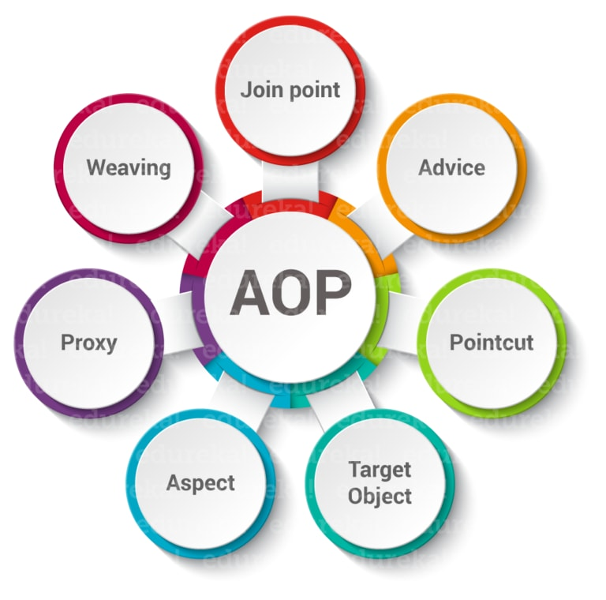
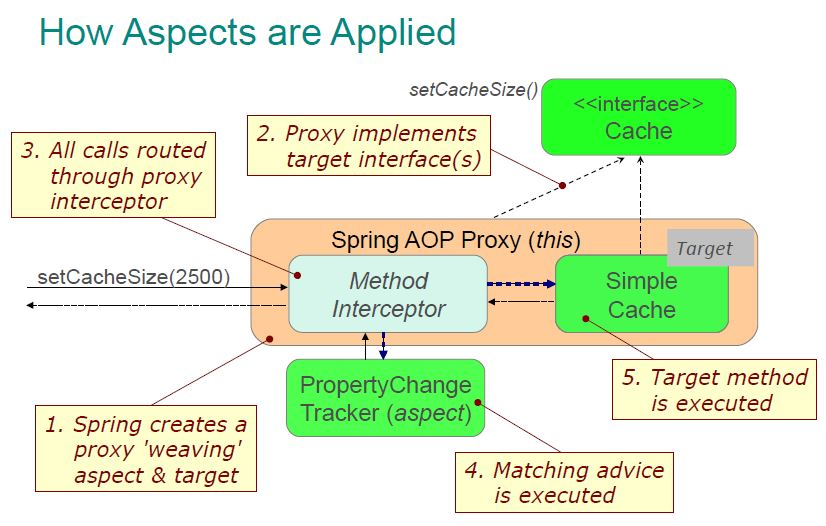

# Aspect Oriented Programming in Spring

Programming paradigm that aims to increase modularity by allowing the separation of 
cross-cutting concerns. It does so by adding additional behavior to existing code (an advice)
without modifying the code itself, instead separately specifying which code is modified 
via a "pointcut" specification
 
 
 
1. __Aspect__: An aspect is a class that implements enterprise application concerns that 
cut across multiple classes, such as transaction management. Aspects can be a normal class 
configured through Spring XML configuration or we can use Spring AspectJ integration to 
define a class as Aspect using @Aspect annotation.

2. __Join Point__: A join point is a specific point in the application such as method 
execution, exception handling, changing object variable values, etc. In Spring AOP a join 
point is always the execution of a method.

3. __Advice__: Advices are actions taken for a particular join point. In terms of 
programming, they are methods that get executed when a certain join point with matching 
pointcut is reached in the application. You can think of Advices as Struts2 interceptors 
or Servlet Filters.

4. __Pointcut__: Pointcut is expressions that are matched with join points to determine 
whether advice needs to be executed or not. Pointcut uses different kinds of expressions 
that are matched with the join points and Spring framework uses the AspectJ pointcut 
expression language.

5. __Target Object__: They are the object on which advices are applied. Spring AOP is 
implemented using runtime proxies so this object is always a proxied object. What is means 
is that a subclass is created at runtime where the target method is overridden and advice 
are included based on their configuration.

6. __AOP proxy__: Spring AOP implementation uses JDK dynamic proxy to create the Proxy 
classes with target classes and advice invocations, these are called AOP proxy classes. 
We can also use CGLIB proxy by adding it as the dependency in the Spring AOP project.

7. __Weaving__: It is the process of linking aspects with other objects to create the advised proxy objects. This can be done at compile time, load time or at runtime. Spring AOP performs weaving at the runtime.

 
 
 ### Types of AOP Advices
 
Based on the execution strategy of advice, they are of the following types.

1. __Before Advice__: These advices runs before the execution of join point methods. We 
can use @Before annotation to mark an advice type as Before advice.

2. __After (finally) Advice__: An advice that gets executed after the join point method 
finishes executing, whether normally or by throwing an exception. We can create after advice
using @After annotation.

3. __After Returning Advice__: Sometimes we want advice methods to execute only if the 
join point method executes normally. We can use @AfterReturning annotation to mark a method
as after returning advice.

4. __After Throwing Advice__: This advice gets executed only when join point method throws
exception, we can use it to rollback the transaction declaratively. We use @AfterThrowing 
annotation for this type of advice.

5. __Around Advice__: This is the most important and powerful advice. This advice surrounds 
the join point method and we can also choose whether to execute the join point method or not.
We can write advice code that gets executed before and after the execution of the join point
method. It is the responsibility of around advice to invoke the join point method and return
values if the method is returning something. We use @Around annotation to create around 
advice methods.
   
--- 

### Links

https://www.journaldev.com/2583/spring-aop-example-tutorial-aspect-advice-pointcut-joinpoint-annotations

https://howtodoinjava.com/spring-aop-tutorial/

