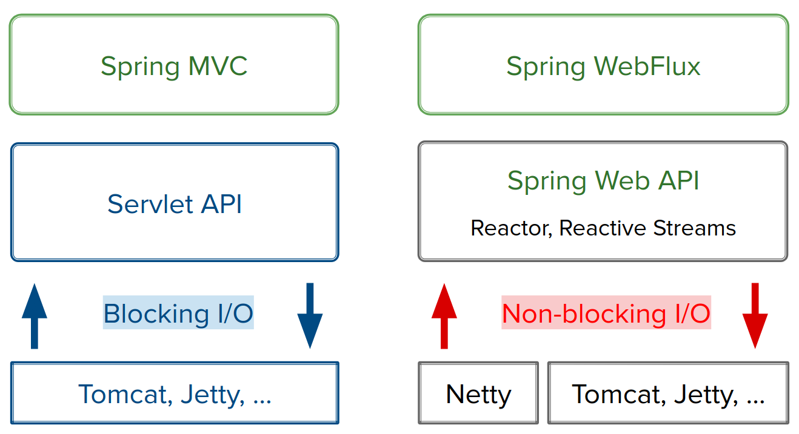
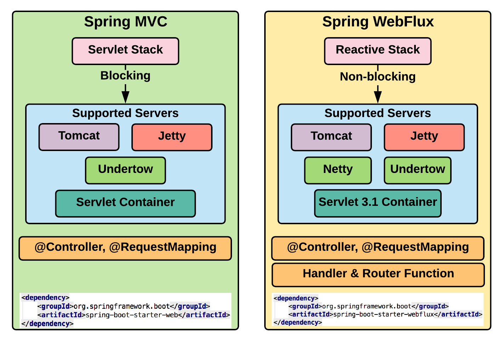
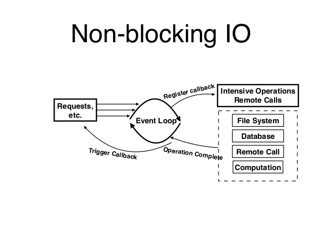

# Spring Webflux

* __WebClient__ (instead of restTemplate)
* __Netty__ (instead of Tomcat), Tomcat can be used but Netty uses 
non-blocking event loop inside

* __WebClient__
    * spring-boot-starter-web -> will use Spring MVC on Tomcat
    * spring-boot-starter-web + spring-boot-starter-webflux -> 
    spring will recognize that webflux is added and will use WebClient +
    Netty by default
    * there is only one webclient inside Netty and only one event loop
    * uses Reactor 
    * nothing happens until you subscribe
    * flatMap in Reactor will automatically subscribe to Flux or Mono
    
* __Netty__
    * there is event loop with 4 threads by default (depends of number
    of processors on machine)
    
    
    
    
### Netty Event Loop

