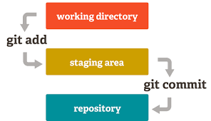

# Git commands

## Git config
* ~/.gitconfig - git config file, example:
```
[user]
        email = peterskurski@gmail.com
        name = Peter Skurski
[core]
        editor = nano
```
* ```git config --global user.name "User Name"```
* ```git config --global user.email "email@address.com"```
* ```git config --global core.editor "nano"```

## Git initialization
* ```git init <folder>``` - creating folder and git repository inside
* ```git init``` - creating git repository in current folder
* ```git clone <repository address>``` - creating folder and copy repository 

## Git staging

* ```git add <file(s)>``` - adding files to staging area
* ```git add .``` - adding all files from working directory

## Git commit 
* ```git commit``` - adding files from staging area to repository, opens editor to add commit message
* ```git commit -m "Message"``` - creating commit with message
* ```git commit -a``` - combining two steps: git add and git commit, git adds only changes in files that already exists in repository
* ```git commit -a -m "Message"``` - with additional message
* ```git commit --interactive``` - interactive console 

## Git log
* ```git log``` - commit log
* ```git log --oneline``` - only commit message
* ```git log --oneline -3``` - only three last commit message
* ```git log --stat``` - information about files changed in each commit
* ```git log --patch``` - information about files and code changed in each commit
* ```git log --since="2018-08-15"``` - logs from date 
* ```git log --since="2 days ago"``` - logs from 2 last days 
* ```git log --until="2018-08-15"``` - logs to date 
* ```git log --grep="initial"``` - filtering logs

## Git diff
* ```git diff``` - difference between staging area and working directory (unstaged)
* ```git diff --staged``` - difference between staging area and repository
* ```git diff 057a2c5``` - difference between our code and chosen commit

## Git checkout
* ```git checkout <branch ID>``` - move to some branch in git history
* ```git checkout master``` - move to master branch
* HEAD - pointer to the point in git repository history which refer to
our working directory

## Git branch
* ```git branch``` - show all branch in local repository
* ```git branch <branchName>``` - create branch, follow up with 
git checkout to switch branch
* ```git branch -d <branchName>``` - delete branch
* ```git checkout -b <branchName>``` - create branch and switch to it
 
#### Managing
* git init , creating empty repository
* git clone <repository­url> , copy repository from remote repository url
* git add , add files to commit
* git add * , add everything
* git commit ­m "Commit message" , commit
* git push <remotename> <branchname> , ex: git push bitbucket feature/1_example
* git status , local status
* git remote add origin <remote­repository­url> ex: git remote add origin https://github...
* git remote ­-v , list remote repositories
* git remote show <remotename> , list all remote branches
* git checkout <branchname>, switch to other local branch
* git checkout ­b <branchname> , create new branch from active branch
* git branch , list local branches
* git branch ­d <branchname> , delete local branch
* git push <remotename> :<branchname> , delete a branch on remote repository
* git push <remotename> ­­delete <branchname> , the same as above
* git pull , fetch and merge from remote to local
* git merge <branchname> , merge a choosen branch into active branch
* git diff , merge conflicts
* git fetch <remotename> , get all remote branches to local remote
* git fetch <remotename> <branchname> , get one branch from remote and update local
(remotename/branchname)
* git fetch <remotename> <branchname>:<branchname> , get one branch from remote,
* git merge <remotename>/<branchname> , merge a remote local copy to active branch
* git checkout ­­ <filename> , undo changes in the file before commit
* git reset ­­hard origin/master , undo all changes, even after commit and return to the state
of remote branch
* git branch ­m <oldname> <newname> , rename any local branch
* git branch ­m <newname> , rename current (active) branch
* git rebase <remotename>/<branchname> , after git fetch <remotename> <branchname>
* git log,  - list of commits (with commit_sha)

#### Reset
* git merge --abort, for new git version, undo last merge (if merge was succesful - MERGE_HEAD exists)
* git reset --hard commit_sha, reset to given commit
* git reset --merge ORIG_HEAD,  undo last merge
* git reset --hard origin/master, reset to some remote tracking branch
